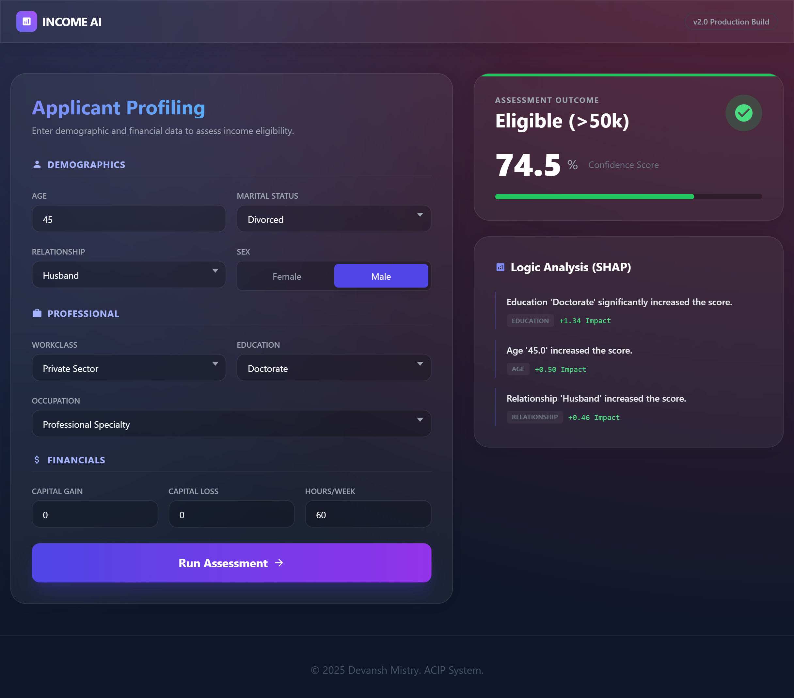

# 💰 Census Income AI: Production Risk Assessment

> **A Full-Stack AI Application predicting financial eligibility using Explainable AI (SHAP) and modern Glassmorphism UI.**



## 🚀 Project Overview
This project simulates a real-world financial risk assessment system. It predicts whether an applicant earns >$50K/year (a common proxy for loan eligibility) based on demographic and employment data.

Unlike standard "black box" AI, this system provides **Human-Readable Explanations** for every decision using SHAP (Shapley Additive exPlanations), making it compliant with "Right to Explain" AI regulations.

## 🏗️ Architecture
The system follows a modern decoupled architecture:

* **Frontend:** React (TypeScript + Vite) with Glassmorphism UI & Framer Motion.
* **Backend:** FastAPI (Python) serving the XGBoost model & SHAP analysis.
* **Model:** Gradient Boosted Trees (XGBoost) tuned for high-precision risk management.

## 🧬 Project Evolution (Research to Production)
This repository demonstrates the full lifecycle of a Machine Learning project:

### Phase 1: Research & Experimentation (`/research_and_legacy`)
* **Data Analysis:** Conducted extensive EDA on the raw Adult Census dataset.
* **Model Benchmarking:**
    * **Deep Learning (PyTorch):** Built a custom ResNet-style MLP with Entity Embeddings. (Recall: 86%).
    * **Gradient Boosting (XGBoost):** Tuned for stability and precision. (Accuracy: 87.5%).
* **Decision:** XGBoost was selected for production due to better performance on tabular data and stricter precision control (80% Precision threshold).

### Phase 2: Production Engineering (`/frontend` & `/backend`)
* **API Development:** Built type-safe endpoints using Pydantic validators.
* **XAI Integration:** Implemented a natural language decoder to translate SHAP values into English (e.g., *"Status 'Never-married' significantly decreases income probability"*).
* **UI/UX:** Designed a physics-based, animated interface to replace static forms.

## 🛠️ Tech Stack

| Component | Technologies |
| :--- | :--- |
| **Frontend** | React, TypeScript, Tailwind CSS, Framer Motion, Axios |
| **Backend** | FastAPI, Uvicorn, Python 3.11 |
| **ML Engine** | XGBoost, Scikit-Learn, SHAP, NumPy, Pandas |
| **Research** | PyTorch, Matplotlib, Seaborn |

## ⚡ Quick Start

### 1. Backend Setup
```bash
cd backend
pip install -r requirements.txt
uvicorn main:app --reload
# Server runs at http://localhost:8000
```

### 2. Frontend Setup
```bash
cd frontend
npm install
npm run dev
# App runs at http://localhost:5173
```

### 📂 Repository Structure
```bash
├── frontend/             # Modern React Application
├── backend/              # FastAPI Server + Tuned Model
│   ├── main.py          # API Endpoints
│   └── model_tuned.pkl  # Production XGBoost Model
├── research_and_legacy/  # Original Experiments (EDA, PyTorch, Baseline)
└── README.md             # Documentation
```


Built by Devansh Mistry
